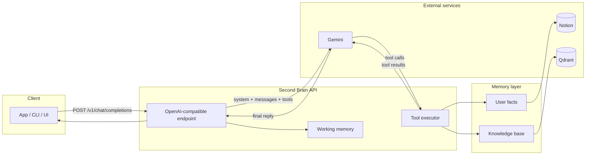

# Second Brain

An **OpenAI-compatible** chat API with **agentic memory**: the model decides when to remember facts about you and when to search your knowledge base. Use it as a drop-in backend for any app that speaks the OpenAI API.

---

## Why this project

- **Your AI should remember you** — Store and recall user facts (e.g. “my favorite color is blue”) via tools, not hard-coded prompts.
- **Your AI should know your docs** — Search a vector store (Notion-backed or custom) when answering; the model chooses when to call the search tool.
- **One API, any client** — Same `POST /v1/chat/completions` contract as OpenAI. Use it from existing UIs, SDKs, or agents without changing your client code.
- **Layered memory** — Short-term (conversation window), user profile (Notion), and knowledge base (Qdrant hybrid search) work together so the model has context when it needs it.

---

## How it works

The server accepts OpenAI-format chat requests, injects **user profile** and **working memory** into the system prompt, and gives the LLM **tools** to read/write memory. The model can call `UpsertUserFact` to save facts (e.g. to Notion) and `SearchKnowledgeBase` to query your docs (Qdrant). Tool results are fed back into the model until it returns a final reply.



**In short:** Your client sends messages → the API adds profile + working memory and calls Gemini with tools → the model may call **UpsertUserFact** (Notion) or **SearchKnowledgeBase** (Qdrant) → the API runs those and returns tool results to the model → the model replies → you get the final answer.

---

## Get started

### 1. Prerequisites

- **Go 1.24+** (for local run) or **Docker** (for container run)
- **Google AI API key** (Gemini) — [Create one](https://aistudio.google.com/apikey)
- Optional: **Notion** (user facts), **Qdrant** (knowledge search)

### 2. Clone and set environment

```bash
git clone https://github.com/yourusername/secondbrain.git
cd secondbrain
cp .env.example .env
```

Edit `.env` and set at least:

```bash
GOOGLE_API_KEY=your-gemini-api-key
```

Optionally set `NOTION_TOKEN` and `NOTION_USER_PROFILE_PAGE_ID` for user facts, and use the full stack (step 4) for the knowledge base.

### 3. Run the server

**Option A — Binary (quickest):**

```bash
make env    # if you haven’t copied .env yet
make build
make run
```

**Option B — Full stack with Docker (server + Qdrant):**

```bash
make up
```

The API will be at **http://localhost:8080**. Check health: **http://localhost:8080/health**.

### 4. Send your first request

```bash
curl -X POST http://localhost:8080/v1/chat/completions \
  -H "Content-Type: application/json" \
  -d '{
    "model": "default",
    "messages": [{"role": "user", "content": "Remember that I prefer dark mode."}]
  }'
```

With Notion configured, the model can store that as a user fact. Ask “What do I prefer?” and it can recall it.

For **knowledge search**, run the full stack (`make up`) so Qdrant is available; then ask questions that require searching your indexed content.

### 5. Use in your app

Use the same URL as your OpenAI base URL:

- **Base URL:** `http://localhost:8080` (or your deployed URL)
- **Endpoint:** `POST /v1/chat/completions`
- **Models:** Use any string (e.g. `default`); the server uses Gemini under the hood.

Optional header: `X-User-ID: <id>` to scope user facts to a profile.

---

## What’s next

- **User facts:** Set `NOTION_TOKEN` and `NOTION_USER_PROFILE_PAGE_ID` in `.env` so the model can read/write your Notion user profile.
- **Knowledge base:** Run `make up` to start Qdrant; index content via your own pipeline and the server will search it when the model calls the tool.
- **Deploy:** Build the Docker image and run it with your `.env` (see [Tech details](TECH.md#build--run) for commands and CI).

---

## Tech details

For **architecture**, **environment variables**, **build & run**, **testing**, and **CI**, see **[TECH.md](TECH.md)**.
