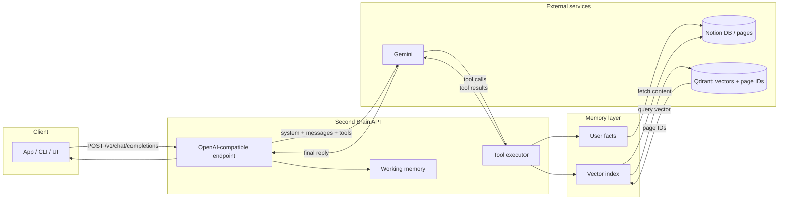

# Second Brain

An **OpenAI-compatible** chat API with **agentic memory**: the model decides when to remember facts about you and when to search your knowledge base. Use it as a drop-in backend for any app that speaks the OpenAI API.

---

## Why this project

- **Your AI should remember you** — Store and recall user facts (e.g. "my favorite color is blue") via tools, not hard-coded prompts.
- **Your AI should know your docs** — The **knowledge graph lives in a Notion database**. Qdrant stores only **vector → Notion page ID** mappings so retrieval stays lightweight and scalable; full content is loaded from Notion when the model searches.
- **One API, any client** — Same `POST /v1/chat/completions` contract as OpenAI. Use it from existing UIs, SDKs, or agents without changing your client code.
- **Layered memory** — Short-term (conversation window), user profile (Notion), and knowledge base (vector index in Qdrant, content in Notion) work together so the model has context when it needs it.

---

## How it works

The server accepts OpenAI-format chat requests, injects **user profile** and **working memory** into the system prompt, and gives the LLM **tools** to read/write memory:

- **UpsertUserFact** — Save facts about the user to their Notion profile.
- **SearchKnowledgeBase** — Query Qdrant (vectors + page IDs), then fetch full content from the Notion database. Returns consolidated text to the model.
- **MemorizeInformation(topic, content)** — Dynamic categorization: if a similar topic already exists (cosine similarity > threshold, default 0.85), append to that Notion page; otherwise create a new page. Then index in Qdrant. Reduces Notion page fragmentation.

For search and memorization: **Qdrant holds only vectors and Notion page IDs**; the **Notion database is the source of truth**. At query time we fetch full page text from Notion.



**In short:** Your client sends messages → the API adds profile + working memory and calls Gemini with tools → the model may call **UpsertUserFact**, **SearchKnowledgeBase**, or **MemorizeInformation** → the API talks to **Qdrant** (vectors + page IDs) and **Notion** (full content) → tool results go back to the model → you get the final answer. Knowledge stays in Notion; Qdrant stays small and scalable.

---

## Get started

### 1. Prerequisites

- **Go 1.24+** (for local run) or **Docker** (for container run)
- **Google AI API key** (Gemini) — [Create one](https://aistudio.google.com/apikey)
- Optional: **Notion** (user profile for facts; Notion database for **MemorizeInformation** and knowledge search), **Qdrant** (vector index for search and memorization)

### 2. Clone and set environment

```bash
git clone https://github.com/yourusername/secondbrain.git
cd secondbrain
cp .env.example .env
```

Edit `.env` and set at least:

```bash
GOOGLE_API_KEY=your-gemini-api-key
```

Optionally set `NOTION_TOKEN`, `NOTION_USER_PROFILE_PAGE_ID` (user facts), and `NOTION_KNOWLEDGE_DATABASE_ID` (for **MemorizeInformation** and knowledge search). See [Setting up Notion](#setting-up-notion) and [TECH.md](TECH.md) and `.env.example` for all variables.

### 3. Run the server

**Option A — Binary (quickest):**

```bash
make env    # if you haven't copied .env yet
make build
make run
```

**Option B — Full stack with Docker (server + Qdrant):**

```bash
make up
```

The API will be at **http://localhost:8080**. Check health: **http://localhost:8080/health**.

### 4. Send your first request

```bash
curl -X POST http://localhost:8080/v1/chat/completions \
  -H "Content-Type: application/json" \
  -d '{
    "model": "default",
    "messages": [{"role": "user", "content": "Remember that I prefer dark mode."}]
  }'
```

With Notion configured, the model can store that as a user fact. Ask "What do I prefer?" and it can recall it.

For **knowledge search**, run the full stack (`make up`) and point the server at a **Notion database** that holds your knowledge. Index that database into Qdrant (vectors + page IDs only); at query time the server fetches the actual content from Notion.

### 5. Use in your app

Use the same URL as your OpenAI base URL:

- **Base URL:** `http://localhost:8080` (or your deployed URL)
- **Endpoint:** `POST /v1/chat/completions`
- **Models:** Use any string (e.g. `default`); the server uses Gemini under the hood.

Optional header: `X-User-ID: <id>` to scope user facts to a profile.

---

## Setting up Notion

Notion is used in two ways: a **user profile page** (for UpsertUserFact) and a **knowledge database** (for MemorizeInformation and knowledge search). Both require a Notion integration and the right IDs.

### 1. Create a Notion integration and get the token

1. Go to [Notion Integrations](https://www.notion.so/my-integrations) and click **New integration**.
2. Name it (e.g. "Second Brain"), pick the workspace, and create.
3. Open the integration's **Settings** and copy the **Internal Integration Secret**. This is your `NOTION_TOKEN`.
4. Put it in `.env`: `NOTION_TOKEN=secret_...`

Every page and database you want the app to use must be **shared with this integration**: open the page or database → **Share** (top right) → **Invite** → select your integration.

### 2. User profile page (for UpsertUserFact)

The app reads and appends **block content** (paragraphs, lists, etc.) on a single Notion page. This becomes the "user profile" injected into the system prompt; the model can append facts via the **UpsertUserFact** tool.

**What you need:**

- **One Notion page** — e.g. "My profile" or "User facts". It can be empty or contain existing text. The app will append new facts as paragraph blocks.
- **Share that page** with your integration (Share → Invite → your integration).

**How to get the page ID:**

1. Open the page in Notion (in the browser).
2. Look at the URL. It will look like:
   - `https://www.notion.so/My-Profile-1a2b3c4d5e6f7890abcdef1234567890`  
   or  
   - `https://www.notion.so/1a2b3c4d5e6f7890abcdef1234567890`
3. The **page ID** is the **32-character hex string** at the end (with or without hyphens). Copy it.
   - Example: `1a2b3c4d5e6f7890abcdef1234567890` or `1a2b3c4d-e5f6-7890-abcd-ef1234567890`
4. In `.env`: `NOTION_USER_PROFILE_PAGE_ID=<that-id>`

No special columns or database are required — it's just a normal page.

### 3. Knowledge database (for MemorizeInformation and search)

The **MemorizeInformation** tool creates and updates pages inside a Notion **database**. Search uses the same database: Qdrant stores vectors and page IDs; full content is loaded from Notion.

**What you need:**

- **A Notion database** (full-page or inline). The app will create new pages in it and append to existing ones.
- **One Title property** — Notion databases always have a "Name" (title) column. The app uses it as the page title (e.g. the "topic" in MemorizeInformation). If your title column is not named **Name**, set:
  - `NOTION_KNOWLEDGE_TITLE_PROPERTY=<your-title-property-name>`
- **Share the database** with your integration (open the database as a full page → Share → Invite → your integration).

**How to get the database ID:**

1. Open the **database** in Notion (as its own page — click the database title or open it from the sidebar so the URL is the database, not a page inside it).
2. The URL will look like:
   - `https://www.notion.so/workspace/2b3c4d5e6f7890abcdef1234567890ab?v=...`  
   or  
   - `https://www.notion.so/2b3c4d5e6f7890abcdef1234567890ab`
3. The **database ID** is the **32-character hex string** (the part before `?` if present). Copy it. You can remove hyphens if Notion shows them; the API accepts both.
4. In `.env`: `NOTION_KNOWLEDGE_DATABASE_ID=<that-id>`

**Summary of required columns:**

| Use case              | Required in Notion |
|-----------------------|--------------------|
| User profile (page)   | None — any page.   |
| Knowledge database    | One **Title** property (default name: `Name`). No other columns required. |

For **knowledge search**, you still need to **index** your Notion pages into Qdrant (vectors + page IDs). The repo does not include an indexer script; you can build one that fetches pages from the same database, embeds them, and calls the same Qdrant upsert the server uses. Until then, **MemorizeInformation** will populate the database and Qdrant as the model uses the tool.

### 4. Optional: Qdrant (vector index)

**SearchKnowledgeBase** and **MemorizeInformation** need a running Qdrant instance. Easiest: run the full stack so Qdrant starts automatically:

```bash
make up
```

The server will use `QDRANT_HOST=qdrant` and `QDRANT_PORT=6334` (set by Docker Compose). No extra config needed.

If you run Qdrant **separately** (e.g. another Docker or cloud):

- **Port:** The app uses **gRPC** only; default port is **6334**. (REST is on 6333, e.g. for healthchecks.)
- In `.env`: set `QDRANT_HOST` and `QDRANT_PORT` (e.g. `QDRANT_HOST=127.0.0.1`, `QDRANT_PORT=6334`).
- The **collection** is created automatically on first use (default name: `knowledge`; override with `QDRANT_COLLECTION`).

---

## What's next

- **User facts:** Set `NOTION_TOKEN` and `NOTION_USER_PROFILE_PAGE_ID` in `.env` (see [Setting up Notion](#setting-up-notion) above).
- **Knowledge base & MemorizeInformation:** Create a Notion database with a Title property, share it with your integration, and set `NOTION_KNOWLEDGE_DATABASE_ID`. Run `make up` (server + Qdrant). The model can then use **MemorizeInformation(topic, content)** to create or update category pages (similarity threshold configurable via env).
- **Configuration:** All tunables are read from **environment variables**. See [TECH.md](TECH.md#environment) and `.env.example` for the full list.
- **Deploy:** Build the Docker image and run it with your `.env` (see [Tech details](TECH.md#build--run) for commands and CI).

---

## Tech details

For **architecture**, **environment variables**, **build & run**, **testing**, and **CI**, see **[TECH.md](TECH.md)**.
